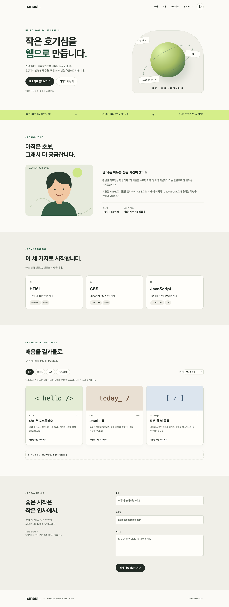
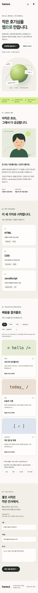
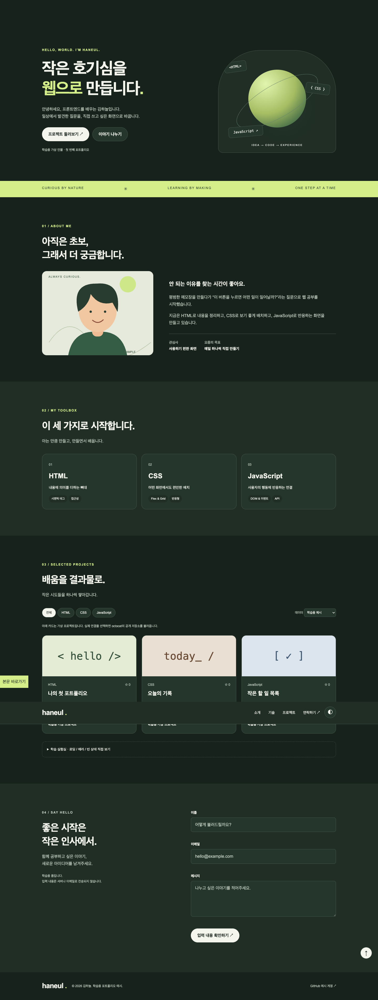

# 김하늘 · 첫 포트폴리오 예시

사용자가 지정한 「나를 소개하는 웹페이지 처음부터 만들기.pdf」 기반 학습 예시입니다. 김하늘의 소개와 프로젝트는 가상입니다.

## 실행

`index.html`을 Chrome으로 열면 됩니다. 과제의 개발 환경을 연습하려면 VS Code에서 이 폴더를 열고 Live Server로 실행하세요. GitHub 실제 연결은 인터넷이 필요합니다.

## 기술과 구조

외부 라이브러리 없이 HTML, CSS, JavaScript만 사용했습니다.

- `index.html`: Hero / About / Skills / Projects / Contact / Footer와 시맨틱 구조
- `css/style.css`: 공통 변수, 테마, Flexbox, Grid, 반응형, 효과
- `js/main.js`: 상태, 이벤트, API 요청, 필터, 폼 검증
- `images/profile.svg`: 가상 프로필 일러스트

## 기능과 기준값

- 모바일 우선, 768px 태블릿 / 1024px 데스크톱 확장
- 햄버거 메뉴, Escape 닫기, 앵커의 부드러운 스크롤
- 60px 이상 스크롤 시 헤더 배경 변경, 300px 이상 맨 위 버튼 표시
- IntersectionObserver threshold 0.2, 움직임 줄이기 설정 대응
- 다크 테마 localStorage 유지. 저장 제한 시 현재 페이지에서만 전환
- 기본값은 가상 카드 3개. Projects → GitHub 실제 연결은 octocat 공개 저장소 최대 100개
- 로딩 / 성공 / 오류 및 재시도 / 빈 결과. 요청 제한 403·429 및 12초 타임아웃 처리
- 언어 필터. 학습 실험실은 가상 상태를 재현하는 추가 기능
- 필수값·이메일 검증, 필드 옆 오류, 첫 오류 초점 이동. 실제 전송 없음
- 외부 데이터 이스케이프와 GitHub HTTPS 링크 검사

## 본인 과제로 바꾸기

1. HTML의 이름, 소개, 기술, 프로필 alt와 SVG를 본인 정보로 수정합니다.
2. main.js의 `GITHUB_USERNAME`을 본인 계정으로 바꾸고 HTML의 예시 계정 문구·링크도 수정합니다.
3. 제출본에서 실제 API를 기본값으로 쓰려면 state.source를 'live', state.status를 'loading'으로 설정하고 HTML select의 live 옵션을 selected로 지정합니다. 초기 실행의 독립된 `renderProjects();` 호출을 `loadProjects();`로 교체하며 source-note도 실제 계정에 맞춥니다. 함수 내부의 renderProjects 호출은 그대로 둡니다.
4. portfolio 폴더 안의 파일들을 본인 GitHub 저장소 루트에 올린 뒤 GitHub Pages로 게시합니다.
5. 실제 URL에서 기능을 검사하고 아래 빈 항목을 실제 주소로 채웁니다.

저장소 URL: 미생성 (로컬 예시)

배포 URL: 미배포

공개 배포와 본인 계정 적용이 남아 있으므로 원문 과제 전체 제출 완료 상태는 아닙니다. VS Code/Live Server의 학습자 환경 구성도 별도입니다.

## 스크린샷

이 링크는 전체 작업 폴더 기준입니다. portfolio만 별도 저장소에 올린다면 스크린샷 파일도 복사하고 상대 경로를 바꾸세요.

## 검증

`../deliverables/verification.json` 참고. Chrome에서 360/390/768/1024/1440px 가로 넘침 없음, 메뉴·스크롤·테마 저장·폼·필터 검사 통과. 테스트 도구로 403/빈 배열/성공 응답과 외부 HTML 문자열을 주입해 처리 확인. 실제 GitHub 요청에서 공개 저장소 8개 확인. API 결과는 시간에 따라 달라질 수 있습니다. 공개 URL의 배포 검증은 하지 않았습니다.

## 문서

- `../deliverables/01_과제내용파악.pdf`
- `../deliverables/02_개념4단계.pdf`
- `../deliverables/03_실전개념적용.pdf`

API 제한: https://docs.github.com/en/rest/using-the-rest-api/rate-limits-for-the-rest-api

Pages 안내: https://docs.github.com/en/pages/getting-started-with-github-pages/configuring-a-publishing-source-for-your-github-pages-site
